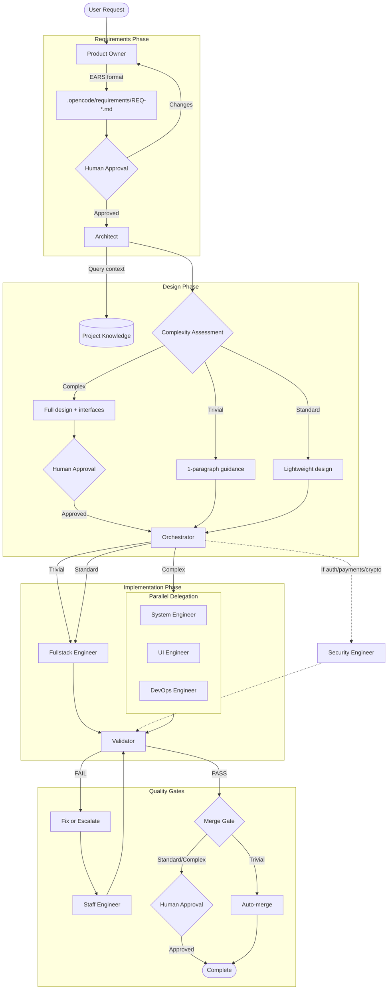

# OpenCode Agent Swarm Configuration

This repository contains a sophisticated multi-agent system built on [OpenCode](https://opencode.ai) for automated software development workflows.

## Overview

Our setup uses a **protocol-driven agent swarm** with clear separation of concerns, human approval gates, and reusable skills. The system follows a structured workflow from requirements gathering through implementation to validation.

## Architecture

### Agent Flow



**Complexity-Based Routing**:
- **Trivial** (60-70%): Express lane → Auto-merge
- **Standard** (20-25%): Streamlined → Merge approval
- **Complex** (10-15%): Full ceremony → All gates

### Key Principles

- **Protocol-Driven**: Agents communicate via XML payloads for structured handoffs
- **Adaptive Execution**: Workflow adapts to architectural complexity
- **Human Gates**: Critical decisions require human approval (requirements, complex design, standard/complex merge)
- **Context Injection**: Sub-agents receive full context via XML to prevent hallucination
- **Circuit Breaker**: Automatic rollback and escalation on repeated failures
- **Complexity Escalation**: Engineers can escalate if scope exceeds expectations
- **One-Way Handoffs**: Clear ownership boundaries (no callback loops)

## Agents

### Primary Agents

#### Product Owner (`product-owner.md`)
**Role**: Requirements gathering and EARS validation  
**Mode**: Primary  
**Triggers**: User requests for new features

**Thought Pattern**: EARS Translation
1. **Context**: Read user preferences from memory
2. **Clarify**: Ask questions if request is vague (never guess)
3. **Translate**: Convert user request to EARS format (Trigger → Response)
4. **Document**: Write `.opencode/requirements/REQ-[id].md`
5. **Gate**: Get human approval before handoff

**Responsibilities**:
- Transform user requests into EARS-formatted requirements
- Validate requirements are unambiguous
- Create `.opencode/requirements/REQ-[id].md` files
- Get human approval before handoff
- Delegate to Architect

**Key Rules**:
- Cannot read or write source code (Air Gap Rule)
- Cannot run shell commands
- Must use EARS templates (Event-Driven, State-Driven, etc.)
- Reads user preferences from memory

### Subagents

#### Architect (`architect.md`)
**Role**: Design and architecture validation with complexity assessment  
**Mode**: Subagent

**Thought Pattern**: Complexity Assessment + Adaptive Design
1. **Context**: Query project-knowledge for relevant files and patterns
2. **Assess**: Evaluate architectural complexity (Trivial/Standard/Complex)
3. **Design**: Create appropriate design artifacts based on complexity
4. **Gate**: Human approval for Complex tier only
5. **Handoff**: Provide tier-specific XML to Orchestrator

**Complexity Tiers**:

**Trivial** (ALL must be true):
- Single component/module affected
- Existing pattern can be reused
- No new interface definitions needed
- No breaking changes
- Low risk (no auth, payments, crypto)
- Clear requirements

**Complex** (ANY triggers full ceremony):
- New architectural pattern needed
- Multiple interface definitions required
- Security-sensitive (auth, payments, crypto, data ingestion)
- Breaking changes to public APIs
- Cross-cutting concerns (>3 domains)
- Unclear requirements

**Standard**: Everything else

**Responsibilities**:
- Validate EARS requirements (reject if ambiguous)
- Assess architectural complexity
- Create tier-appropriate design artifacts:
  * Trivial: 1-paragraph guidance + pattern reference
  * Standard: Lightweight design doc + interfaces
  * Complex: Full design doc (SoT) + comprehensive interfaces
- Get human approval on Complex tier only
- Hand off to Orchestrator with complexity tier

**Key Protocols**:
- **EARS Gatekeeper**: Reject non-compliant requirements
- **Context First**: Always query project-knowledge before designing
- **Complexity Assessment**: Objective criteria for tier selection
- **Adaptive Design**: Design depth matches complexity

#### Orchestrator (`orchestrator.md`)
**Role**: Implementation coordination and gate management with adaptive execution  
**Mode**: Subagent

**Thought Pattern**: Adaptive Execution Strategy
1. **Parse**: Extract complexity tier from Architect's handoff
2. **Setup**: Create worktree (all tiers for safety)
3. **Plan**: Task planning based on tier (skip/minimal/full)
4. **Delegate**: Tier-appropriate delegation strategy
5. **Gates**: Conditional gates based on tier and risk
6. **Merge**: Auto-merge for Trivial, human approval for Standard/Complex

**Execution Strategies by Tier**:

**Trivial (Express Lane)**:
- Skip task planning (single obvious task)
- Direct assignment to Fullstack Engineer (minimal XML)
- Skip security gate (low risk)
- Mandatory validation gate
- Auto-merge on validation pass
- ~60-70% time savings

**Standard (Streamlined)**:
- Minimal task planning
- Single engineer (Fullstack) with standard XML
- Conditional security gate (if touches auth/payments/crypto)
- Mandatory validation gate
- Human merge approval
- ~30-40% time savings

**Complex (Full Ceremony)**:
- Full task decomposition
- Parallel specialist delegation (System/UI/DevOps)
- Mandatory security gate (if sensitive)
- Mandatory validation gate
- Human merge approval
- Full ceremony maintained

**Responsibilities**:
- Parse complexity tier from Architect
- Create isolated worktrees for all tiers
- Adapt execution strategy to complexity
- Delegate to appropriate engineers
- Manage conditional gates (security, validation, merge)
- Handle complexity escalations from engineers
- Clean up worktrees after completion

**Key Protocols**:
- **Context Injection**: Provide full context via XML (prevents cold boot hallucination)
- **Circuit Breaker**: Rollback and escalate after 3 failures or >$2 cost
- **Complexity Escalation**: Re-engage Architect if engineer reports scope growth
- **PBT Selection**: Require property-based testing for data transformation, math, crypto
- **Feasibility Authority**: Make implementation calls without callback to Architect

#### Engineering Specialists

**System Engineer** (`system-engineer.md`)
- Backend logic and business rules
- **Thought Pattern**: Chain of Code (CoC)
  - Simulate: Draft interface/pseudocode in `sequentialthinking`
  - Execute: Immediately implement with `edit_file`
  - Silence: Keep draft in tool, don't output to chat
- Uses code graph for context discovery

**UI Engineer** (`ui-engineer.md`)
- Frontend components and visual elements
- **Thought Pattern**: Chain of Draft (CoD)
  - Draft: Plan component structure (JSX hierarchy, CSS classes, state/props)
  - Execute: Immediately implement with `edit_file`
  - Silence: Keep draft in tool, don't output to chat
- Uses `canvas_render` to verify visual output

**DevOps Engineer** (`devops-engineer.md`)
- Infrastructure, CI/CD, deployment
- **Thought Pattern**: Chain of Code (CoC)
  - Simulate: Draft configuration/script in `sequentialthinking`
  - Execute: Immediately implement
  - Silence: Keep draft in tool
- Terraform, Docker, GitHub Actions expertise

**Fullstack Engineer** (`fullstack-engineer.md`)
- Atomic tasks (<3 files only)
- **Mode**: Primary (can be invoked directly for quick tasks)
- **Thought Pattern**: Chain of Code (CoC)
  - Same as System Engineer but with strict file limit
  - Delegates if scope exceeds 3 files
- Handles Trivial and Standard tier tasks from Orchestrator
- Escalates to Orchestrator if complexity exceeds expectations
- Cross-stack features

**QA Engineer** (`qa-engineer.md`)
- Unit, integration, and property-based tests
- **Thought Pattern**: EARS Mapping
  - Translate requirements to test cases
  - EARS: "When [X], System shall [Y]" → Test: "When [X], should [Y]"
  - AAA pattern (Arrange-Act-Assert)
- 80% coverage minimum, 90% target
- Property-based testing for data transformation, math, crypto

**Security Engineer** (`security-engineer.md`)
- Security audits for auth, payments, crypto
- **Thought Pattern**: Data Flow Analysis
  - Trace tainted data through code graph
  - Hunt for vulnerability patterns (injection, XSS, secrets)
  - Report findings without fixing (read-only)
- OWASP compliance

**Documentation Engineer** (`documentation-engineer.md`)
- Technical documentation
- API docs, README updates

#### Support Agents

**Staff Engineer** (`staff-engineer.md`)
- Complex debugging and rescue missions
- **Mode**: All (primary + subagent) - Can act as "Human Proxy" for rapid PO/Architect phases
- **Thought Pattern**: Anti-Hallucination Protocol
  - Verify: Read live documentation with `webfetch`/`chrome-devtools`/MCP servers before using new libraries
  - Analyze: Trace dependencies deep into `node_modules` with code graph
  - Implement: Only after verification
- New library integration
- Cross-cutting changes (>3 domains)
- Delegates to Orchestrator for structured execution, or implements directly for quick fixes (<5 files)

**Validator** (`validator.md`)
- Quality gatekeeper
- **Mode**: All (primary + subagent) - Can be invoked directly for quality checks
- **Thought Pattern**: Three-Verdict System
  - FAIL: Logic bugs, missed requirements, failing tests
  - WARN: Style issues (functional but messy)
  - PASS: Perfect compliance
- Cannot edit code (read-only)
- Runs linters, tests, checks requirements coverage

**Project Knowledge** (`project-knowledge.md`)
- Project memory and context management
- **Thought Pattern**: Graph + Memory Synthesis
  - Query code graph for structural context
  - Query memory for lessons learned
  - Synthesize into actionable context map
- Memory audits every 10 tasks or >500 lines

## Tools

Agents use a variety of tools for code intelligence, context discovery, and verification.

### Core Tools

- `codegraphcontext` - AST-based code graph for finding definitions, callers, and tracing data flows
- `lsp` - Language Server Protocol for type checking and symbol navigation
- `sequentialthinking` - Internal drafting tool for Chain of Code/Draft patterns
- `Context7` - Query official documentation for well-known libraries

### Verification Tools

- `canvas_render` - Visual verification for UI components (used by UI Engineer)
- `chrome-devtools` - Browser automation for live documentation verification
- `webfetch` - Fetch and parse web pages for documentation

### MCP Servers

Agents can leverage Model Context Protocol (MCP) servers for extended capabilities. Check `.kiro/settings/mcp.json` for registered library servers. Staff Engineer can register new servers via gitmcp.io for libraries without existing MCP support.

## Skills

Skills are reusable instruction sets loaded on-demand by agents. Located in `skills/` directory.

### Available Skills

#### `bash-strategy`
Safe shell command execution patterns. Prevents destructive operations.

#### `code-style-analyst`
Pattern recognition for existing code style. Ensures consistency with codebase conventions.

#### `coding-guidelines`
Core coding principles: naming, error handling, security, testing standards.

#### `dependency-management`
Pre-approved library lists, security vetting, version pinning standards.

**Pre-approved Libraries**:
- Testing: jest, vitest, pytest, testify, fast-check
- Dev Tools: eslint, prettier, golangci-lint

#### `design-architect`
Technical design document standards. Table of contents, Mermaid diagrams, external references.

#### `git-workflow`
Conventional commits, branching strategy, PR standards, semantic versioning.

#### `golang-expert`
Go-specific best practices: Clean Architecture, microservices, OpenTelemetry, performance.

#### `memory-management`
Memory audit protocol, conflict resolution, garbage collection. Triggers every 10 tasks or >500 lines.

#### `prompt-engineering`
Effective prompt construction for AI agents.

#### `task-planner`
Task breakdown standards. Rule of 3 (≤3 files per task), requirements/design linking.

#### `technical-writer`
Documentation standards for user-facing content.

#### `terraform-expert`
Infrastructure as Code best practices for Terraform.

#### `testing-standards`
Comprehensive testing guidance: unit, integration, property-based, E2E. Testing pyramid ratios.

## Protocols

### Complexity Tiers

The Architect assesses architectural complexity and selects the appropriate execution path. This ensures simple tasks get streamlined processing while complex work receives full ceremony.

#### Trivial Tier (Express Lane)

**Criteria (ALL must be true)**:
- Single component/module affected
- Existing pattern can be reused
- No new interface definitions needed
- No breaking changes to existing interfaces
- Low risk (no auth, payments, crypto, data ingestion)
- Clear from requirements what needs to change

**Examples**: Bug fixes, typos, config tweaks, doc updates, linter fixes

**Workflow**:
1. Architect: 1-paragraph guidance + pattern reference
2. Orchestrator: Direct assignment to Fullstack Engineer (no task planning)
3. Engineer: Quick implementation following existing pattern
4. Validator: Mandatory validation
5. Auto-merge on validation pass (no human approval)

**Time Savings**: ~60-70% compared to full ceremony

#### Standard Tier (Streamlined)

**Criteria**: Doesn't meet Trivial, doesn't trigger Complex

**Examples**: Small features with existing patterns, refactors, new endpoints using established patterns

**Workflow**:
1. Architect: Lightweight design doc + interfaces (no approval gate)
2. Orchestrator: Single engineer assignment (minimal task planning)
3. Engineer: Standard implementation (2-3 files)
4. Security: Conditional (if touches auth/payments/crypto)
5. Validator: Mandatory validation
6. Human merge approval required

**Time Savings**: ~30-40% compared to full ceremony

#### Complex Tier (Full Ceremony)

**Criteria (ANY triggers this)**:
- New architectural pattern needed
- Multiple interface definitions required
- Security-sensitive (auth, payments, crypto, data ingestion)
- Breaking changes to public APIs
- Cross-cutting concerns (affects >3 domains)
- Unclear requirements or ambiguous scope

**Examples**: New features with new patterns, OAuth integration, payment processing, major refactors

**Workflow**:
1. Architect: Full design doc with SoT + comprehensive interfaces + human approval
2. Orchestrator: Full task decomposition + parallel specialist delegation
3. Engineers: Multiple specialists working in parallel
4. Security: Mandatory if sensitive
5. Validator: Mandatory validation
6. Human merge approval required

**Time Savings**: None (appropriate ceremony for complexity)

#### Complexity Escalation

If an engineer discovers during implementation that complexity exceeds the assessed tier:

1. Engineer stops implementation immediately
2. Engineer reports to Orchestrator: "Complexity exceeds [tier]"
3. Orchestrator pauses execution
4. Orchestrator calls Architect with escalation context
5. Architect reassesses and provides proper design
6. Orchestrator restarts with correct tier
7. Escalation documented in project memory

### XML Handoff Format

**Product Owner → Architect**:
```xml
<handoff type="requirements">
  <context>
    <constraint>[User Pref 1]</constraint>
  </context>
  <requirements>
    <file>.opencode/requirements/REQ-[id].md</file>
  </requirements>
  <goal>[Brief summary]</goal>
</handoff>
```

**Architect → Orchestrator (Trivial)**:
```xml
<handoff type="express">
  <complexity>trivial</complexity>
  <context>
    <pattern>[existing-pattern-name]</pattern>
    <component>[component-path]</component>
    <rationale>[why this is trivial]</rationale>
  </context>
  <requirements>
    <file>.opencode/requirements/REQ-[id].md</file>
  </requirements>
  <guidance>
    [1-paragraph guidance: what to change, which pattern to follow]
  </guidance>
  <target_files>
    <file>[path/to/file.ext]</file>
  </target_files>
  <approval_gate>false</approval_gate>
  <test_strategy>unit</test_strategy>
  <goal>[Brief summary]</goal>
</handoff>
```

**Architect → Orchestrator (Standard)**:
```xml
<handoff type="streamlined">
  <complexity>standard</complexity>
  <design>
    <file>.opencode/designs/[feature].md</file>
    <interfaces>
      <file>src/types.ts</file>
    </interfaces>
  </design>
  <requirements>
    <file>.opencode/requirements/REQ-[id].md</file>
  </requirements>
  <approval_gate>false</approval_gate>
  <test_strategy>unit</test_strategy>
  <goal>[Brief summary]</goal>
</handoff>
```

**Architect → Orchestrator (Complex)**:
```xml
<handoff type="design">
  <complexity>complex</complexity>
  <context>
    <constraint>[User Pref 1]</constraint>
  </context>
  <design>
    <file>.opencode/designs/[feature].md</file>
    <interfaces>
      <file>src/types.ts</file>
      <file>src/interfaces.go</file>
    </interfaces>
  </design>
  <requirements>
    <file>.opencode/requirements/REQ-[id].md</file>
  </requirements>
  <approval_gate>true</approval_gate>
  <test_strategy>property</test_strategy>
  <goal>[Brief summary]</goal>
</handoff>
```

**Orchestrator → Engineer (Trivial)**:
```xml
<task type="express">
  <objective>[1-sentence goal]</objective>
  <guidance>[Architect's guidance paragraph]</guidance>
  <resources>
    <requirements_doc>.opencode/requirements/REQ-[id].md</requirements_doc>
    <target_file>[path/to/file]</target_file>
    <pattern_reference>[existing pattern to follow]</pattern_reference>
  </resources>
  <protocol>
    <instruction>Use Chain of Code. Follow existing pattern. Quick implementation.</instruction>
    <test_strategy>unit</test_strategy>
    <complexity>trivial</complexity>
  </protocol>
</task>
```

**Orchestrator → Engineer (Standard/Complex)**:
```xml
<task type="implementation">
  <objective>Implement the UUID generator logic.</objective>
  <resources>
    <design_doc>.opencode/designs/utils.md</design_doc>
    <target_file>src/utils.ts</target_file>
    <interface_file>src/types.ts</interface_file>
  </resources>
  <protocol>
    <instruction>Use Chain of Code. Do not chat. Output code immediately.</instruction>
    <test_strategy>property</test_strategy>
  </protocol>
</task>
```

**Orchestrator → Validator (Per-Phase)**:
```xml
<validation type="incremental">
  <scope>
    <phase>1</phase>
    <tasks>1.1, 1.2, 1.3</tasks>
    <requirements_doc>.opencode/requirements/REQ-[id].md</requirements_doc>
    <task_doc>.opencode/tasks/TASKS-[id].md</task_doc>
  </scope>
  <prior_validations>.opencode/validations/TASKS-[id]/</prior_validations>
  <files>
    <file>[files modified in this phase]</file>
  </files>
</validation>
```

**Orchestrator → Validator (Final Integration)**:
```xml
<validation type="integration">
  <scope>
    <requirements_doc>.opencode/requirements/REQ-[id].md</requirements_doc>
    <design_doc>.opencode/designs/[feature].md</design_doc>
    <task_doc>.opencode/tasks/TASKS-[id].md</task_doc>
  </scope>
  <prior_validations>.opencode/validations/TASKS-[id]/</prior_validations>
</validation>
```

**Product Owner → Architect (Resume Assessment)**:
```xml
<resume_assessment>
  <task_doc>.opencode/tasks/TASKS-[id].md</task_doc>
  <validation_dir>.opencode/validations/TASKS-[id]/</validation_dir>
  <design_doc>.opencode/designs/[feature].md</design_doc>
  <requirements_doc>.opencode/requirements/REQ-[id].md</requirements_doc>
</resume_assessment>
```

**Architect → Orchestrator (Resume)**:
```xml
<handoff type="resume">
  <complexity>[from task doc]</complexity>
  <design>
    <file>.opencode/designs/[feature].md</file>
  </design>
  <requirements>
    <file>.opencode/requirements/REQ-[id].md</file>
  </requirements>
  <task_doc>.opencode/tasks/TASKS-[id].md</task_doc>
  <resume_from>
    <phase>[N]</phase>
    <reason>[why resuming here]</reason>
  </resume_from>
  <validation_state>
    <passed_phases>[1, 2]</passed_phases>
    <failed_phase>[3]</failed_phase>
  </validation_state>
</handoff>
```

### EARS Requirements Format

All requirements use [EARS syntax](https://alistairmavin.com/ears/) for unambiguous specifications:

- **Ubiquitous**: The system shall [response].
- **Event-Driven**: When [trigger], the system shall [response].
- **State-Driven**: While [state], the system shall [response].
- **Optional**: Where [feature] is present, the system shall [response].
- **Unwanted**: If [condition], then the system shall [response].

### Testing Strategy Selection

**Property-Based Testing** required for:
- Data transformation (parsers, converters)
- Math/financial logic (billing, scoring)
- Cryptography/security (hashing, sanitization)

**Unit Testing** for all other features.

## File Structure

```
.
├── agents/                    # Agent definitions
│   ├── architect.md
│   ├── orchestrator.md
│   ├── product-owner.md
│   ├── system-engineer.md
│   ├── ui-engineer.md
│   ├── devops-engineer.md
│   ├── fullstack-engineer.md
│   ├── qa-engineer.md
│   ├── security-engineer.md
│   ├── documentation-engineer.md
│   ├── staff-engineer.md
│   ├── validator.md
│   └── project-knowledge.md
├── skills/                    # Reusable instruction sets
│   ├── bash-strategy/
│   ├── code-style-analyst/
│   ├── coding-guidelines/
│   ├── dependency-management/
│   ├── design-architect/
│   ├── git-workflow/
│   ├── golang-expert/
│   ├── memory-management/
│   ├── prompt-engineering/
│   ├── task-planner/
│   ├── technical-writer/
│   ├── terraform-expert/
│   └── testing-standards/
├── memory/                    # Project memory
│   ├── human.md              # User preferences
│   └── persona.md            # Agent personality
├── opencode.json             # OpenCode configuration
└── README.md                 # This file
```

## Usage

### Starting a New Feature

1. **Describe your feature** to the Product Owner agent
2. **Review requirements** when prompted (approval gate)
3. **Review architecture** when Architect presents design (approval gate)
4. **Monitor progress** as Orchestrator delegates to engineers
5. **Approve merge** when Validator passes (approval gate)

### Invoking Specific Agents

Use `@agent-name` in chat to invoke subagents directly:
- `@architect` - For design questions
- `@validator` - To check code quality
- `@project-knowledge` - To query project context
- `@staff-engineer` - For complex debugging

### Switching Primary Agents

Use `Tab` key to cycle between primary agents (Product Owner, etc.)

## Configuration

### Agent Configuration (`opencode.json`)

Agents are configured with:
- `description`: What the agent does
- `mode`: primary, subagent, or all
- `model`: LLM model to use
- `maxSteps`: Maximum agentic iterations
- `tools`: Available tools (boolean flags)
- `permissions`: allow, ask, or deny for sensitive operations

### Skill Configuration

Skills are markdown files with YAML frontmatter:
```yaml
---
name: skill-name
description: What the skill provides
---
```

## Best Practices

### For Users

- **Be specific** in feature requests
- **Review gates carefully** (requirements, design, merge)
- **Trust the process** - agents handle implementation details
- **Interrupt if needed** - you can stop any agent mid-execution

### For Agent Developers

- **Follow protocols** - XML handoffs, EARS format, conventional commits
- **Respect boundaries** - no callback loops, one-way handoffs
- **Document decisions** - use project-knowledge for lessons learned
- **Test thoroughly** - 80% coverage minimum
- **Keep tasks atomic** - ≤3 files per task

## Troubleshooting

### Agent Not Found
Ensure agent file exists in `agents/` directory and has correct frontmatter.

### Permission Denied
Check agent's `permissions` section in frontmatter. Some operations require `allow`.

### Circuit Breaker Triggered
Agent failed 3 times or exceeded $2 cost. Staff Engineer will be called automatically.

### Requirements Rejected
Architect found ambiguous requirements. Revise using EARS templates.

## Contributing

When adding new agents or skills:

1. Follow existing frontmatter format
2. Document protocols and workflows
3. Add to this README
4. Test with sample features
5. Use conventional commits

## Resources

- [OpenCode Documentation](https://opencode.ai/docs)
- [EARS Requirements](https://alistairmavin.com/ears/)
- [Conventional Commits](https://www.conventionalcommits.org/)
- [Semantic Versioning](https://semver.org/)

## License

This configuration is part of your project. Adjust licensing as needed.
